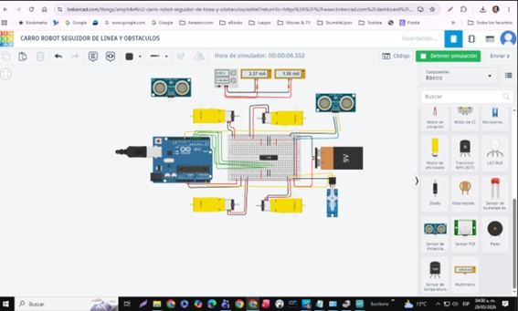
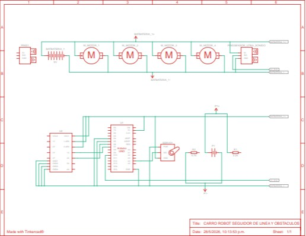

#  Carro Seguidor de Líneas de Colores — Proyecto Final Sistemas Digitales 🚗

> **Fundación Universitaria Compensar · Sistemas Digitales**  

>Alumno: Gilbert Alejandro Angel Jimenes / Jorge torrenegra / Angel Cruz
  
> Docente: Diego Alejandro Barragán Vargas


## ¿Que se quiso lograr?
La idea central es que el carro ruede sobre una pista con segmentos de 
diferentes colores, negro, blanco, rojo, verde y azul y sea capaz de 
identificar en tiempo real sobre qué color está pasando. Esa información 
viaja desde el Arduino hasta una aplicación web donde se visualiza al instante.
Pero no se quedó solo en eso. El proyecto tiene tres capas:
- **El hardware:** un chasis 4WD ensamblado a mano, con un sensor de color 
  NY70 que ve la pista, un driver L298N que controla los motores, y un 
  módulo Bluetooth HC-05 para comunicación inalámbrica.

- **El software embebido:** código en Arduino que lee el sensor, clasifica el 
  color y lo transmite por serial o Bluetooth hacia la PC, además de recibir 
  comandos de movimiento de vuelta.

- **La interfaz web:** una app en Streamlit que muestra el color detectado en 
  tiempo real, incluye un chatbot con inteligencia artificial capaz de explicar 
  el proyecto, y permite controlar el carro con comandos de voz — solo diciendo 
  "adelante", "izquierda" o "detente".

En resumen: un sistema donde el hardware, el software y la IA trabajan juntos 
para que un carro de madera y cables sea capaz de leer su entorno y obedecer 
tu voz.


## Objetivo del Proyecto

Diseñar e implementar un sistema embebido basado en Arduino que:

- Siga líneas de **5 colores distintos (negro, blanco, rojo, verde, azul)
- Transmita el color detectado en tiempo real a una app web en Streamlit
- Incluya un chatbot conversacional que explique el proyecto
- Reciba comandos de voz para controlar el movimiento del carro (arriba, abajo, derecha, izquierda)
- Comunicación bidireccional Arduino ↔ PC vía USB o Bluetooth


## 📸 Así quedó el Carro

> Aquí está el proceso completo:

### Fase 1 — Ensamblaje inicial del chasis

Aca tenemos que ensamblar todas las piezas, armar el chasis que a la final no se dificulto tanto como lo pensabamos
| Vista frontal con sensor ultrasónico | Vista superior con Arduino |
|--------------------------------------|---------------------------|
|  | .jpeg) |

### Fase 2 — Integración de componentes en el laboratorio

Acá si fue un poco complejo porque veiamos Cables por todos lados y es un poco canson y miedo a llegar a quemar algo y arruinar el trabajo hecho

| Revisando conexiones del driver de motores | Vista completa del cableado |
|--------------------------------------------|-----------------------------|
| .jpeg) |  |

### Fase 3 — Cableado fino y sensor de color

La parte más delicada. El NY70/HC-05 tiene pines muy juntos y en este punto ya teníamos el multi­metro de ayuda

| Ajuste de pines del sensor | Conexiones del módulo Bluetooth HC-05 |
|----------------------------|---------------------------------------|
| .jpeg) | .jpeg) |


## Componentes utilizados

| Componente | Especificación | ¿Para qué sirve? |
|---|---|---|
| **Arduino Uno** | ATmega328P | El cerebro de todo. Recibe datos del sensor y controla los motores |
| **Sensor de color** |NY70 | Detecta el color de la línea bajo el carro |
| **Chasis** | 4WD MDF | La base física del carro — lo armamos nosotros |
| **Motores DC** | 3–6V con ruedas amarillas | La tracción, sin ellos sería solo una tabla con cables |
| **Driver de motores** | L298N | Controla dirección y velocidad de cada motor |
| **Batería** | 9V / Pack Li-ion 7.4V | Alimenta todo el sistema |
| **Módulo Bluetooth** | HC-05 (opcional) | Comunicación inalámbrica con la PC |
| **Sensor ultrasónico** | HC-SR04 | Detección de obstáculos (feature extra 👀) |
| **Protoboard + cables** | Jumpers M-M, M-H | Las conexiones que mantienen todo unido |


## ⚙️ ¿Cómo funciona todo junto?

El flujo es más sencillo de lo que parece una vez que lo ves completo:

[Línea de color en el piso]
        ↓
[Sensor TCS3200 detecta el color]
        ↓
[Arduino Uno procesa la lectura]
        ↓  ←— también recibe comandos de movimiento
[Comunicación Serial / Bluetooth HC-05]
        ↓
[Python lee el puerto COM / /dev/rfcomm0]
        ↓
[Streamlit muestra el color en tiempo real]
        ↓
[Chatbot responde preguntas sobre el proyecto]
[Reconocimiento de voz envía comandos al Arduino]


 **VaLIDACIÓN Y PRUEBAS**
 **Simulación en Tinkercad**
Se realizaron simulaciones electrónicas y lógicas utilizando Tinkercad con el fin de:
•	validar conexiones.
•	verificar lectura de sensores.
•	comprobar lógica de movimiento.
•	analizar comportamiento de motores.





La simulación permitió detectar errores de conexión y optimizar el sistema antes de su implementación física además de identificar posibles fallas de potencias y distribución de energía .

Validación en Arduino IDE
Se realizaron pruebas de compilación y depuración del código en Arduino IDE verificando:
•	comunicación serial.
•	respuesta Bluetooth.
•	lectura de sensores.
•	control de motores.
•	estabilidad lógica del programa.
Pruebas físicas
Se realizaron pruebas funcionales sobre el prototipo físico verificando:
•	seguimiento de líneas.
•	respuesta ante obstáculos.
•	estabilidad de movimiento.
•	transmisión de datos Bluetooth.
•	funcionamiento del servomotor.


 RESULTADOS
Los resultados obtenidos demostraron que el robot fue capaz de:

•	seguir líneas correctamente.
•	realizar movimientos autónomos.
•	detectar cambios de trayectoria.
•	evitar obstáculos.
•	ejecutar comandos Bluetooth.
•	Chat Bot Fenputadora
Las simulaciones en Tinkercad y las pruebas físicas permitieron validar la funcionalidad general del sistema como también la mitigación de problemas físicos.


##  Instalación y uso

### 1. Clonamos el repositorio

```bash
git clone https://github.com/TU_USUARIO/carro-seguidor-colores.git
cd carro-seguidor-colores
```

### 2. Instalamos las dependencias de Python

```bash
pip install -r requirements.txt
```

El `requirements.txt` incluye:
```
streamlit
pyserial
speechrecognition
anthropic        # Para el chatbot con Claude
pyaudio
```

### 3. Cargamos el código al Arduino

Abre `arduino/carro_seguidor.ino` en el Arduino IDE y cárgalo al Arduino Uno. Antes de cargar, verifica en la pestaña de calibración cuáles son los valores RGB que entrega el sensor para cada color en tu pista — cada impresión es diferente.

### 4. Conectamos el Arduino y corremos la app

```bash
# Asegúrate de cambiar el puerto COM en serial_bridge.py
# Windows: COM3, COM4, etc.
# Linux/Mac: /dev/ttyUSB0, /dev/rfcomm0 (Bluetooth)

streamlit run streamlit_app/app.py
```

### 5. Listo

La app se abre en `http://localhost:8501`. Desde ahí puedes ver el color detectado en tiempo real, hablarle al chatbot y darle comandos de voz al carro.


## 🎙️ Comandos de voz disponibles

| Lo que dices | Lo que hace el carro |
|---|---|
| *"Arriba"* / *"Adelante"* | Avanza hacia adelante |
| *"Abajo"* / *"Atrás"* | Retrocede |
| *"Derecha"* | Gira a la derecha |
| *"Izquierda"* | Gira a la izquierda |
| *"Detente"* / *"Para"* | Frena |


## Colores que detecta el carro

La pista tiene segmentos de 5 colores distintos y el carro identifica en cuál está:

| Color | ¿Qué pasa en Streamlit? |
|---|---|
| ⬛ Negro | Se muestra fondo negro con texto blanco |
| ⬜ Blanco | Fondo blanco, texto oscuro |
| 🔴 Rojo | Alerta visual en rojo |
| 🟢 Verde | Indicador verde activo |
| 🔵 Azul | Panel azul iluminado |


## El Chatbot

Integramos un chatbot usando la API de Claude (Anthropic) que puede responder preguntas como:

- *"¿Qué componentes usaron?"*
- *"¿Cómo funciona el sensor de color?"*
- *"¿Por qué eligieron el L298N y no el L293D?"*
- *"¿Cómo conectaron el HC-05?"*

El chatbot tiene contexto completo del proyecto, así que puede explicar desde el cableado hasta la arquitectura del software.


## Problemas que nos encontramos (y cómo los resolvimos)

Porque un repositorio honesto incluye las partes malas también:

**El HC-05 no emparejaba con Windows 11**  
→ Solución: hay que ponerlo en modo AT y cambiar la velocidad de baudios a 9600. Usamos el comando `AT+UART=9600,0,0`.

**El TCS3200 confundía el rojo con el naranja bajo luz fluorescente**  
→ Solución: calibrar los valores en el mismo ambiente donde va a funcionar. Los valores del datasheet son solo un punto de partida.

**El carro se iba recto aunque le mandáramos girar**  
→ Solución: los motores del lado derecho e izquierdo no son idénticos. Tuvimos que ajustar el PWM de cada lado por separado.

**Streamlit se reiniciaba cada vez que llegaba un dato serial**  
→ Solución: `st.session_state` para guardar el estado entre reruns, y threading para la lectura serial en segundo plano.


## Diagrama de conexiones con el arduino


Arduino Uno
├── Pin 2  → TCS3200 S0
├── Pin 3  → TCS3200 S1
├── Pin 4  → TCS3200 S2
├── Pin 5  → TCS3200 S3
├── Pin 6  → TCS3200 OUT
├── Pin 7  → L298N IN1
├── Pin 8  → L298N IN2
├── Pin 9  → L298N IN3 (PWM)
├── Pin 10 → L298N IN4 (PWM)
├── Pin 11 → HC-05 TX
├── Pin 12 → HC-05 RX
├── 5V     → TCS3200 VCC, HC-05 VCC
└── GND    → Todo el GND común


 **CONCLUSIONES**
•	Arduino UNO permitió implementar un sistema robótico funcional de bajo costo.
•	Los sensores CNY70 ofrecieron un comportamiento adecuado para seguimiento de líneas.
•	El módulo L298N permitió controlar correctamente los motores del robot.
•	Las simulaciones en Tinkercad facilitaron la validación temprana del sistema.
•	La integración de hardware y software permitió desarrollar un prototipo funcional de robótica móvil autónoma.
